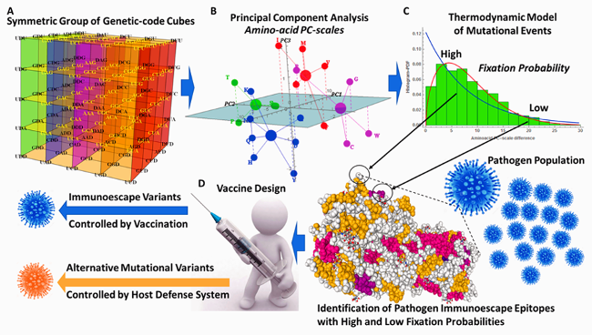
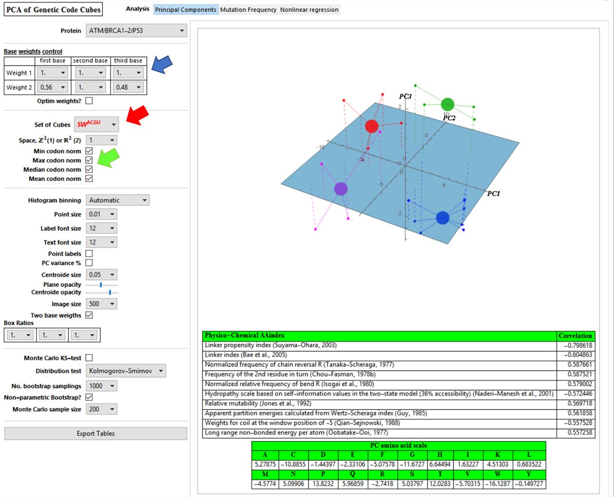
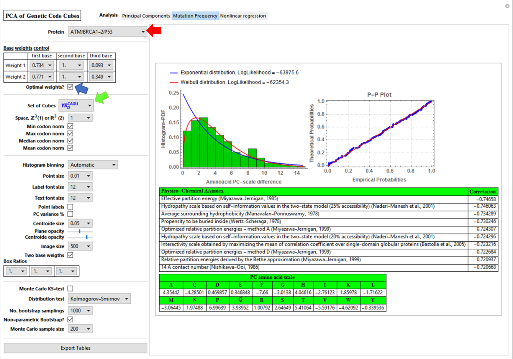
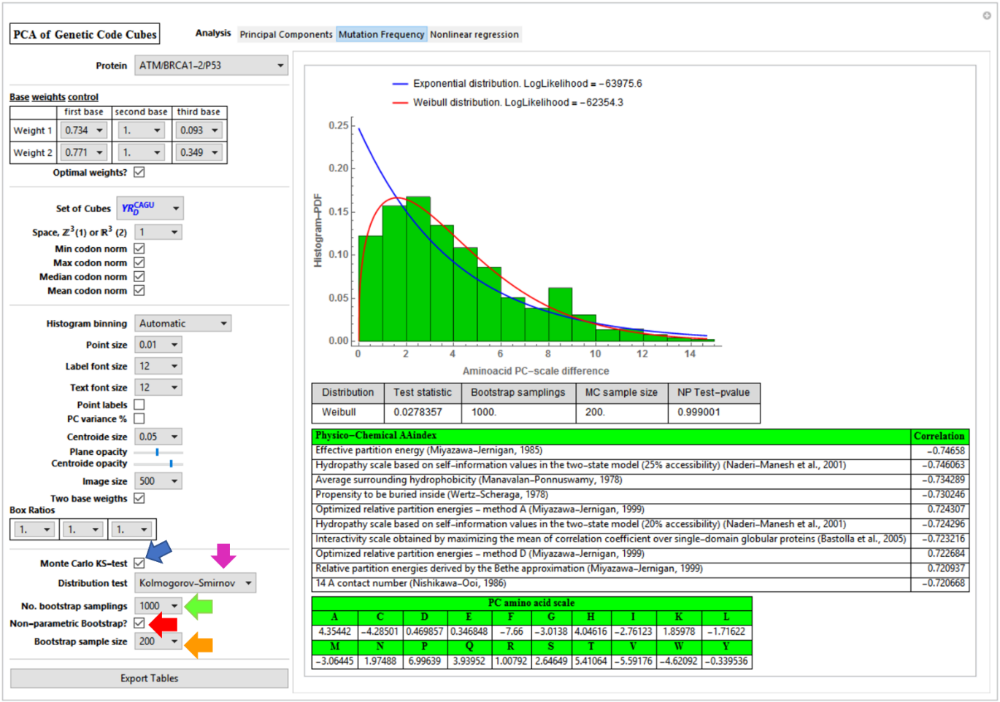
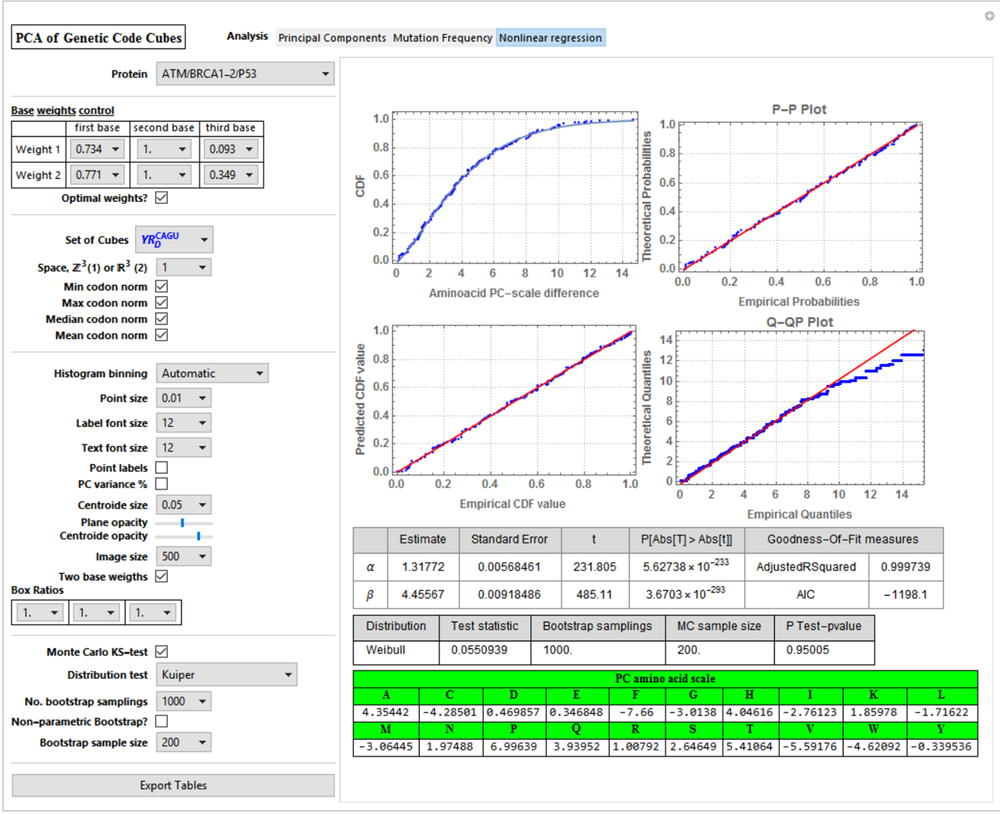

```{r setup, include=FALSE}
knitr::opts_chunk$set(echo = TRUE)

```

# Symmetric Group of the Genetic-Code Cubes
## Supporting Material
  
  Robersy Sanchez  
  Department of Biology. Eberly College of Science.  
  Pennsylvania State University, University Park, PA 16802  
  rus547@psu.edu  
  [ORCID: orcid.org/0000-0002-5246-1453](https://orcid.org/0000-0002-5246-1453)  

# Overview 

<br>
**Figure 1**. Graphical summary of the subjects covered by this work. **A**, the
development of the symmetric group of the genetic-code cubes is presented.
**B**, amino-acid PC-scales from codon norms are derived from subsets of the
genetic-code cubes and optimized on a set of homologous proteins. It is shown
that the amino-acid PC-scales are correlated with the physicochemical indexes
reported by studies on protein folding and protein interactions. **C**, a
Weibull probability distribution model based on the thermodynamics of the
mutational process on gene populations is estimated on experimental datasets of
aligned mutational variants of protein sequences. **D**, a feasible application
of this result to de novo vaccine design is provided.

This material is supporting information for the paper "_Symmetric Group of the
Genetic-Code Cubes. Effect of the Genetic-Code Architecture on the Evolutionary
Process_" [@Sanchez2018]. The derivation of the algebraic structure of the
symmetric group of the genetic-code cubes $(GC,\circ)$ is given in the
manuscript. A deep complexity of the quantitative relationships between codons
and their encoded amino acids is unveiled by group $(GC,\circ)$. These
quantitative relationships expressed by group $(GC,\circ)$, its subgroups and
cosets were quantitatively manifested in the amino-acid PC-scales derived from
codon norms. These scales are strongly correlated with the physicochemical
indexes reported by studies on protein folding and protein interactions. The
effect of the genetic code architecture on the evolutionary process was exposed
by a Weibull distribution model inferred for the mutational process. For a set
of homologous protein, different amino PC-scales can be estimated in different
subsets of genetic code-cubes through the application of an optimization
algorithm. The size of the set of all possible amino-acid PC-scales is large
enough to reflect the huge diversity of evolutionary strategies found in natural
protein-encoded genes. The result presented here would be particularly relevant
to predict immunoescape epitope variants originated in populations of pathogenic
microorganisms and viruses. This knowledge would improve the lifespan of _de
novo_ vaccines as well as the neutralization of potential superbugs. Current
results indicate that, on thermodynamic basis, a stochastic deterministic
mutational process is constrained by the genetic code architecture.

# 1. Requirements
The documents available here are Wolfram Mathematica Notebooks. To interact with
these notebooks users can download Wolfram Player, freely available (for Windows
and Linux OS) at ,https://www.wolfram.com/player/>, which permit the user
interaction with the document. That is, this notebooks are something similar to
a PDF with the fundamental difference that readers can perform by
himself/herself the computations discussed in the text. A Wolfram Player can be
used to interact with a Mathematica noteboo in the same way that, for example,
Adobe Reader is required to open a PDF. The installation of Wolfram Player is
straightforward.

# 2. Introduction to $Z_5$-Genetic-Code vector space
An interactive introduction to $Z_5$-Genetic-Code vector space is given in the
notebook: _IntroductionToZ5GeneticCodeVectorSpace.nb_.  This notebook would be useful
for the undergraduate students cursing Abstract Algebra, since several basic
abstract concepts and mathematical operations are now visualized in the concret
scenario of the genetic code cubes. However, no specialized knowledge is
required to read it, and those concepts not explained in the document have
external links to Wikipedia, Mathwork or Groupprops (group property wiki). So, a
student can study its content in a self-taught way. The theoretical background
for $Z_5$-Genetic-Code vector space is given in [@Sanchez2009].

# 3. Genetic-Code-Scales of Aminoacids
The application of the theory developed in the paper [@Sanchez2018] is
illustrated in the notebook:   _Genetic-Code-Scales_of_Amino-Acids.nb_. This is
a Mathematica notebook containing an interactive graphical user interface tool
to generate genetic code based PC-scales. File
GeneticCodePC-scales&Weibull-fit_snapshots.pdf on how to use the notebook and
file _GeneticCodeScales.wl_ is required to run
_Genetic-Code-Scales_of_Amino-Acids.nb_ and both files must be in the same
folder.

  The subjacent sets from the subgroups of the symmetric group of genetic-code
  cubes are given to explore different options to generate PC scales of amino
  acids correlated with physicochemical properties found in AAindex database
  [@Kawashima2008]. The analysis for six protein sequence alignments is provided
  as well:
  
  1) Repeat domain of breast cancer type 2 susceptibility protein  
  2) Oxaloacetate decarboxylase, gamma chain  
  3) p53 DNA binding domain  
  4) Photosynthesis system II assembly factor YCF48 (PSII BNR repeat protein)  
  5) Influenza HA protein  
  6) HIV-1 ENV  protein
  7) HIV-1 GAG protein. 

  For each scale created by the user, the notebook will estimate the cumulative
  distribution function to estimate probability of fixation of a given mutation
  in the population of selected protein.

# Introductory Snapshots to the Genetic-Code-Scales of Amino-Acids Notebook

Two sets of weight (blue arrow) can be selected to evaluated Eq. 5 from the main
text. The subset of genetic-code cubes where Eq. 5 will be evaluated can be
selected as well (red arrow). By default, all the statistics (Min, Max, Mean and
Median) of codon norms are selected, but the user could choose between them
(green arrow).



If “Optimal weights” is selected (below, blue arrow), then weights are
automatically changed to the best values found for the selected set of
genetic-code cubes (green arrow) and on the set of protein sequence alignments
of the protein selected (red arrow).  In general, these weights are local
optima, which can be found by applying genetic algorithm (in the present case)
or any other suitable optimization algorithm.  If the “Mutation Frequency” tab
is selected in the “Analysis” menu, some fitting details of Weibull distribution
model estimated for the given set of protein sequence alignment are given, as
well as, the amino acid PC-scale and its correlations with amino acid
physicochemical indexes found in AAindex.



If Monte Carlo KS-test is selected (below, blue arrow), then a table with the
test results is shown. We can choose between Kolmogorov-Smirnov and Kuiper tests
(magenta arrow), the number of bootstrap (green arrow) samplings and sample size
(orange arrow). Parametric and non-parametric bootstrap options are available as
well.



The “Nonlinear regression” tab from “Analysis” menu summarize the fitting of
Weibull model on the set of protein sequence alignment selected.  Different
setting for weight values can be given unselecting “Optimal weights” and
selecting a distinct set of genetic-code cubes. Additional “cosmetic” features
are added. It is worthy to notice that the computation could take variable time
for each protein selected. The processing time will vary depending on the
computer processor power used to run the notebook. Unfortunately, I could not
find the way to add a progress indicator that could work inside of the
“Manipulate” function from Wolfram Mathematica.




# References

