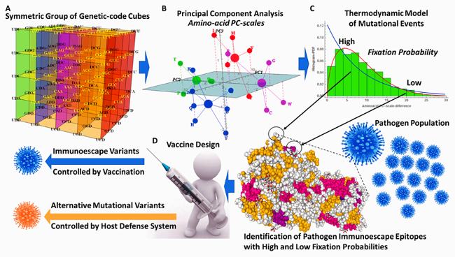

# Symmetric Group of the Genetic-Code Cubes

## Supporting Material

Robersy Sanchez  
Department of Biology. Eberly College of Science.  
Pennsylvania State University, University Park, PA 16802  
<rus547@psu.edu>  
ORCID: orcid.org/0000-0002-5246-1453

# Overview

   **Figure 1**. Graphical
summary of the subjects covered by this work. **A**, the development of
the symmetric group of the genetic-code cubes is presented. **B**,
amino-acid PC-scales from codon norms are derived from subsets of the
genetic-code cubes and optimized on a set of homologous proteins. It is
shown that the amino-acid PC-scales are correlated with the
physicochemical indexes reported by studies on protein folding and
protein interactions. **C**, a Weibull probability distribution model
based on the thermodynamics of the mutational process on gene
populations is estimated on experimental datasets of aligned mutational
variants of protein sequences. **D**, a feasible application of this
result to de novo vaccine design is provided.

This material is supporting information for the paper “*Symmetric Group
of the Genetic-Code Cubes. Effect of the Genetic-Code Architecture on
the Evolutionary Process*” (Sanchez 2018). The derivation of the
algebraic structure of the symmetric group of the genetic-code cubes
(*G**C*,  ∘ ) is given in the manuscript. A deep complexity of the
quantitative relationships between codons and their encoded amino acids
is unveiled by group (*G**C*,  ∘ ). These quantitative relationships
expressed by group (*G**C*,  ∘ ), its subgroups and cosets were
quantitatively manifested in the amino-acid PC-scales derived from codon
norms. These scales are strongly correlated with the physicochemical
indexes reported by studies on protein folding and protein interactions.
The effect of the genetic code architecture on the evolutionary process
was exposed by a Weibull distribution model inferred for the mutational
process. For a set of homologous protein, different amino PC-scales can
be estimated in different subsets of genetic code-cubes through the
application of an optimization algorithm. The size of the set of all
possible amino-acid PC-scales is large enough to reflect the huge
diversity of evolutionary strategies found in natural protein-encoded
genes. The result presented here would be particularly relevant to
predict immunoescape epitope variants originated in populations of
pathogenic microorganisms and viruses. This knowledge would improve the
lifespan of *de novo* vaccines as well as the neutralization of
potential superbugs. Current results indicate that, on thermodynamic
basis, a stochastic deterministic mutational process is constrained by
the genetic code architecture.

# 1. Requirements

The documents available here are Wolfram Mathematica Notebooks. To
interact with these notebooks users can download Wolfram Player, freely
available (for Windows and Linux OS) at
,<https://www.wolfram.com/player/>&gt;, which permit the user
interaction with the document. That is, this notebooks are something
similar to a PDF with the fundamental difference that readers can
perform by himself/herself the computations discussed in the text. A
Wolfram Player is can be used to interact with a Mathematica notebook,
in the same way that, for example, Adobe Reader is required to open a
PDF. The installation of Wolfram Player is straightforward.

# 2. Introduction to *Z*5-Genetic-Code vector space

An interactive introduction to *Z*5-Genetic-Code vector space
is given in the notebook: *IntroductionToZ5GeneticCodeVectorSpace.nb*.
This CDF would be useful for the undergraduate students cursing Abstract
Algebra, since several basic abstract concepts and mathematical
operations are now visualized in the concret scenario of the genetic
code cubes. However, no specialized knowledge is required to read it,
and those concepts not explained in the document have external links to
Wikipedia, Mathwork or Groupprops (group property wiki). So, a student
can study its content in a self-taught way. The theoretical background
for *Z*5-Genetic-Code vector space is given in (Sánchez and
Grau 2009).

# 3. Genetic-Code-Scales of Aminoacids

The application of the theory developed in the paper (Sanchez 2018) is
illustrated in the CDF: *Genetic-Code-Scales\_of\_Amino-Acids.nb*. This
is a Mathematica notebook containing an interactive graphical user
interface tool to generate genetic code based PC-scales. File
GeneticCodePC-scales&Weibull-fit\_snapshots.pdf on how to use the
notebook and file *GeneticCodeScales.wl* is required to run
*Genetic-Code-Scales\_of\_Amino-Acids.nb* and both files must be in the
same folder.

The subjacent sets from the subgroups of the symmetric group of
genetic-code cubes are given to explore different options to generate PC
scales of amino acids correlated with physicochemical properties found
in AAindex database (Kawashima et al. 2008). The analysis for six
protein sequence alignments is provided as well:

1.  Repeat domain of breast cancer type 2 susceptibility protein  
2.  Oxaloacetate decarboxylase, gamma chain  
3.  p53 DNA binding domain  
4.  Photosynthesis system II assembly factor YCF48 (PSII BNR repeat
    protein)  
5.  Influenza HA protein  
6.  HIV-1 ENV protein
7.  HIV-1 GAG protein.

For each scale created by the user, the notebook will estimate the
cumulative distribution function to estimate probability of fixation of
a given mutation in the population of selected protein.

# References

Kawashima, Shuichi, Piotr Pokarowski, Maria Pokarowska, Andrzej
Kolinski, Toshiaki Katayama, and Minoru Kanehisa. 2008. “AAindex: amino acid index database, progress report
2008.” *Nucleic Acids Research* 36 (suppl 1): D202–5.
<https://doi.org/10.1093/nar/gkm998>.

Sanchez, Robersy. 2018. “Symmetric Group of the
Genetic-Code Cubes. Effect of the Genetic-Code Architecture on the
Evolutionary Process.” *MATCH Commun. Math. Comput. Chem.* 79:
527–60.
<http://match.pmf.kg.ac.rs/electronic_versions/Match79/n3/match79n3_527-560.pdf>.

Sánchez, Robersy, and Ricardo Grau. 2009. “An Algebraic Hypothesis about
the Primeval Genetic Code Architecture.” *Mathematical Biosciences* 221
(1): 60–76. https://doi.org/<https://doi.org/10.1016/j.mbs.2009.07.001>.
